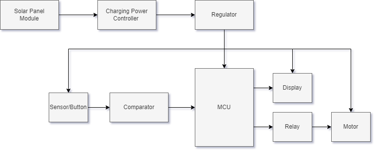
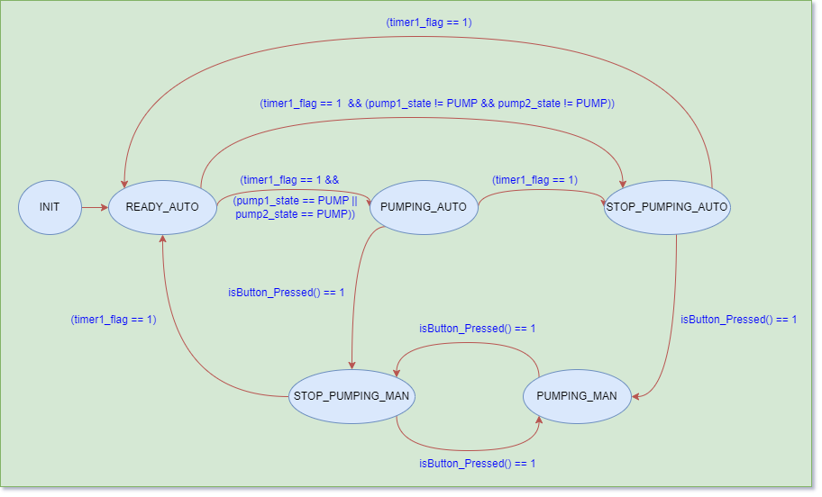

# ES_SolarPlantWateringSystem
The limitation and inefficiency of traditional plant watering methods:

-Rely on manual or inefficient irrigation practices ⇒ water wastage, inconsistent watering, increased labor costs.

-Affect to growth and health ⇒  optimization of plant growth is not good.
# Scope and Objectives definition
-Automated, self-sustaining system → distribute water to plants based on their individual needs.

-Connect and apply to smart sensors → ensure communication between devices.

-Control mechanisms and water delivery systems → ensure precise and targeted irrigation.

-Incorporate sustainability principles →  minimize resource consumption.
# Requirements
-Can check and respond to the watering plants automatically through soil moisture levels.

-Can water plant when used switch or button.

-Incorporate sensors to read various environmental parameters like soil moisture. 

-Distribute water precisely and evenly to the plants. 

-Utilize solar power for charging battery and continuous operation.
# System design
-Block diagram

   
 

-Finite State Machine

   
 

# Integration

   
 
